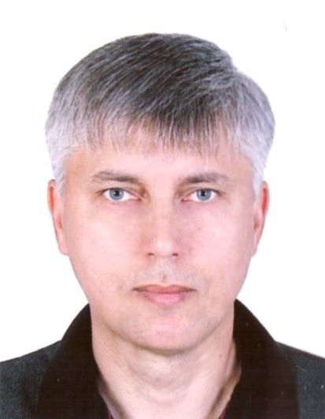

 
# **Матвиюк Виталий Михайлович**

*47 лет, женат, имею сына.* 

## **Образование**
### **Высшее**
*1997 Армавирский государственный педагогический институт,
физико-математический факультет, отделение математики и информатики, специальность - математика и информатика.*

### **Аспирантура**
*2002 Армавирский государственный педагогический институт, по специальности "Теория и методика преподавания(математика)".*

### **В настоящее время осваиваю курс профессиональной переподготовки "Программист на JavaScript"**  

## **Ключевые навыки**  
*Знание языковРусский — Родной  
Английский — Начальный*

### **Навыки** 
* *Организация учебного процесса* 
* *Работа с оргтехникой Администрирование*
* *Сборка и ремонт ПК*
* *Техническое обслуживание ПК*
* *Настройка ПК*
* *Руководство коллективом* 
* *Настройка ПО* 
* *Организаторские навыки* 
* *Обучение персонала*
* *Умение работать в команде*
* *Написание научных статей*
* *И многое другое*

## **Дополнительная информация**
*Целеустремленность, ответственность, общительность. стойкость в стрессовых ситуациях;
активная жизненная позиция; инициативность; нацеленность на результат; организаторские
способность. Готовность к обучению. Возможность работы в различных сферах. Огромное
желание в полной мере реализовать свой потенциал в подобающих условиях. Большой опыт
написания научных статей, включенных в РИНЦ (РОССИЙСКИЙ ИНДЕКС НАУЧНОГО
ЦИТИРОВАНИЯ) - национальную библиографическую базу данных научного цитирования,
аккумулирующую более 12 миллионов публикаций российских авторов, а также информацию о
цитировании этих публикаций из более 6000 российских журналов. Число публикаций на elibrary.ru -
22. Число публикаций в РИНЦ - 15. Индекс Хирша по публикациям в РИНЦ - 8.
Имею высшую квалификационную категорию по специальности учитель информатики.*
